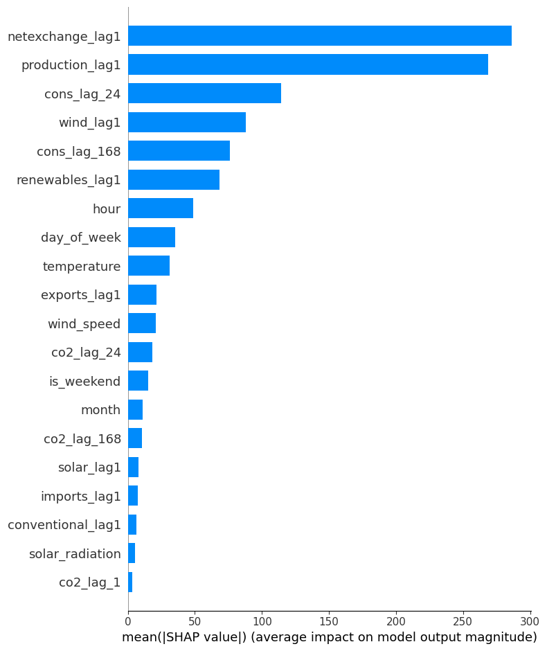
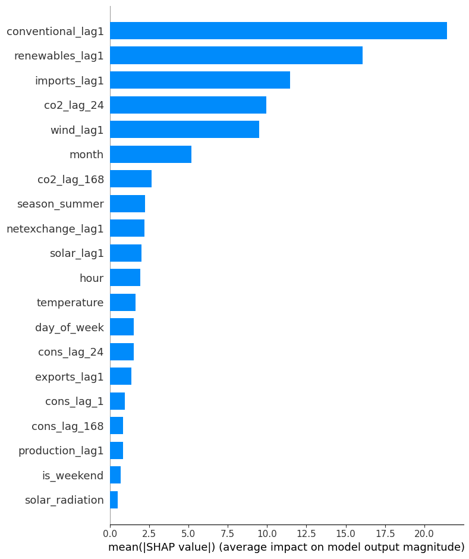

# Forecasting electricity consumption and CO₂ intensity in Denmark's DK1 region

Master's thesis project · University of Southern Denmark · June 2026  
Authors: **Md Abdul Wahid Raju and Sifat Islam**

## Project overview

We compared one-hour-ahead forecasts of electricity consumption and CO₂ intensity in DK1 (Western Denmark) using hourly observations from 2022–2024. The project combines Energinet electricity and carbon-intensity data with DMI weather observations. It uses time-based features and lagged measurements, compares persistence baselines, linear regression and gradient boosting, and examines feature importance and SHAP values.

**Main finding:** Gradient boosting improved consumption forecasts, but the simple previous-hour baseline remained best for CO₂ intensity by mean absolute error (MAE). That distinction matters when deciding whether a more complex model is useful.

## Results on the held-out 2024 test year

| Target | Selected result | Comparison |
| --- | ---: | --- |
| Electricity consumption | Gradient boosting MAE **65.13 MWh** | **36.5%** lower MAE than lag-1 persistence |
| CO₂ intensity | Lag-1 persistence MAE **15.52 gCO₂/kWh** | Gradient boosting MAE **15.70 gCO₂/kWh** |

The dataset was split by time: training through September 2023, validation October–December 2023, and testing in 2024. The models avoid using same-hour production, exchange or target measurements as forecast inputs. The study assumes the weather variables at the forecast horizon would be available from a weather forecast; using observed weather in the historical evaluation may make the operational result optimistic. Feature importance from the full models is dominated by the previous target value, so we also examine models without that feature for diagnostic interpretation. These associations do not establish causal effects.

## Repository contents

| File | Purpose |
| --- | --- |
| `thesis.pdf` | Full jointly authored thesis, including methodology, figures and limitations |
| `notebooks/01_co2_dataset_eda.ipynb` | Cleans and aggregates five-minute CO₂ measurements |
| `notebooks/02_settlement_eda.ipynb` | Cleans hourly settlement and generation data |
| `notebooks/03_weather_eda.ipynb` | Cleans and aggregates ten-minute weather observations |
| `notebooks/04_data_preparation_and_eda.ipynb` | Aligns data sources, creates features and explores the time series |
| `notebooks/05_modelling_and_evaluation.ipynb` | Baselines, time splits, gradient boosting, evaluation and interpretation |
| `requirements.txt` | Python packages used by the notebooks |
| `data/README.md` | Required raw and processed input files |
| `figures/` | SHAP summaries exported from the saved modeling notebook |

The notebook outputs are retained so results and figures can be inspected without rerunning the code. The notebooks were developed with file paths relative to the working directory; run from a directory containing the required CSV files, or update the paths in their loading cells.

## Reproducing the analysis

1. Create a Python environment and install `requirements.txt`.
2. Obtain the three original input CSV files described in `data/README.md`. Source data are excluded from this public repository package.
3. Run the notebooks in numbered order from a working directory containing the CSVs. The first three create processed source files for the fourth, which creates the model-ready file for the fifth.

The data-preparation notebook writes `final_dataset_model_ready.csv`, which the modeling notebook reads. The saved outputs in the notebooks were checked against the final thesis, but the full five-notebook pipeline has not been rerun in this environment. Results may vary with package versions and upstream data revisions.

## What changes when lag-1 is removed?

The previous-hour target is the strongest input in the full forecasting models. Removing it is a **diagnostic sensitivity analysis**, not an improvement in forecast accuracy. Consumption MAE rises from **65.13** to **107.54 MWh**; CO₂ gradient boosting MAE rises from **15.70** to **36.74 gCO₂/kWh**. The following plots show mean absolute SHAP values for a 1,000-row sample from the 2024 test period of the reduced models.

For consumption, **lagged net exchange** and **lagged total production** contribute most in this diagnostic model, followed by consumption 24 hours earlier, lagged wind, and consumption 168 hours earlier. Time and weather variables also contribute. These are associations within the fitted model and should not be interpreted as causal effects.

For CO₂ intensity, **lagged conventional generation** and **lagged renewable generation** lead, followed by lagged imports, CO₂ intensity 24 hours earlier, and lagged wind. Mean absolute SHAP value ranks contribution magnitude, not whether a feature raises or lowers the prediction. The full-model figures and additional analysis are in the modeling notebook and thesis.

## Skills demonstrated

Python · pandas · time-series data preparation · leakage-aware evaluation · scikit-learn · gradient boosting · MAE/RMSE · SHAP · energy analytics

## Attribution

This is a **joint thesis** by Md Abdul Wahid Raju and Sifat Islam. Electricity and carbon-intensity data originate from Energinet; weather observations originate from the Danish Meteorological Institute (DMI). See the thesis for the detailed source descriptions and references. No claim of sole authorship is intended.
